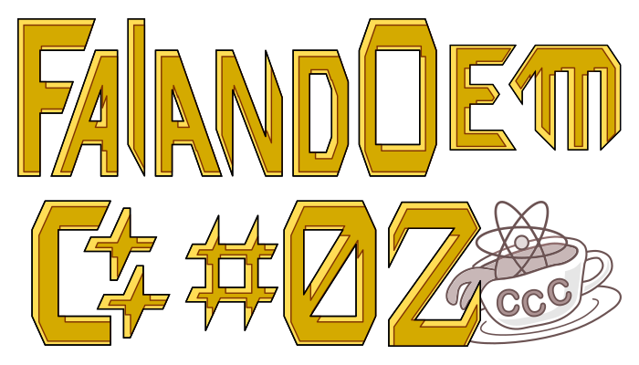

# Ferramentas de OOP

Não estou publicando tanto quanto eu gostaria. Essa pandemia interminável, a guerra fútil da Rússia e o calor de verão do Rio me deixam cansado. Ainda tem a incerteza de correr atrás de  emprego. Mas ante-ontem, mês passado, reuni coragem para falar sobre as ferramentas de programação orientada a objetos (OOP) e especialização do comportamento da classe `Deque`, vista no [primeiro post da série](https://cienciacomcafeina.blogspot.com/2021/10/falando-cmm-01.html). Este tutorial é um pouco avançado, pra quem já conhece um pouco de programação em linguagem C/C++.

**Dificuldade**: :coffee::coffee:

## Como não reinventar a roda?

A forma de construir objetos complexos é fazendo uma *composição* ou *extensão* de objetos mais simples, que fazem *exatamente* aquilo que se espera deles. Em programação, não é diferente. Em C++, alguns mecanismos essenciais para isto são *herança*, *sobrecarga*, *funções virtuais*, *classes abstratas* e *templates*.

### Herança
Herança é uma forma de criar um corpo de funções e variáveis comum à diferentes objetos. Por exemplo, uma companhia de logística possui diversos veículos automotivos. Se for necessário conhecer o custo de viagem e disponibilidade de cada veículo, podemos escrever a classe:
```cpp
class Veiculo {
	int _id; // número único para cada veículo
public:
	double custoViagem(int de, int para); // em R$
	bool disponivel(); // pode rodar agora?
};
```
Porém, cada cliente requer um tipo diferente de veículo. Para ter um controle melhor, precisamos derivar cada tipo a partir da classe anterior, usando dois pontinhos e o especificador de acesso (`public`, `private` ou `protected`):
```cpp
class Carro: public Veiculo { ... };
class Moto:  public Veiculo { ... };
class Aviao: public Veiculo { ... };
```
As classes `Carro`, `Moto` e `Aviao` **herdam** as funções e variáveis da classe `Veiculo`. Elas são as classes derivadas/filhas, enquanto `Veiculo` é a classe base/mãe. Com especificador `public`, as classes filhas podem usar tudo que é público ou protegido da classe mãe. Vou deixar mais pra falar disso no futuro.

Os três pontinhos indicam as funções específicas de cada classe derivada. Há algo que não podemos negligenciar neste exemplo, a maneira de calcular o custo de viagem para aviões é muito diferente daquela usada para veículos terrestres, o que nos leva ao próximo tópico...

### Sobrecarga

Para calcular custo de viagem de aviões, implementamos uma função própria:
```cpp
class Aviao: public Veiculo {
public:
	double custoViagem(int de, int para) {
		int x = // alguma conta cabrunhosa
		return x;
	}
};
```
A função `Aviao::custoViagem()` é uma **sobrecarga** de `Veiculo::custoViagem()`. Como este é apenas um exemplo alegórico, para demonstrar as ferramentas de uma linguagem orientada a objetos, não coloquei nenhuma conta cabrunhosa. Pode ser que, no futuro, você precise usar a função definida na classe mãe dentro da função sobrecarregada, basta chamar como se fosse no escopo da classe, `Veiculo::custoViagem()`.

Na verdade, podemos sobrecarregar a mesma função várias vezes no mesmo escopo e também operadores (indexador, operações matemáticas ou lógicas). Por exemplo, em certas situações, podemos precisar do custo por quilometro rodado. Então, podemos definir duas funções:
```cpp
double custoViagem(int de, int para);  // por cidades cadastradas
double custoViagem(int kms);           // por quilometro rodado
```
O compilador fica encarregado de determinar a função usada em cada caso. Se não conseguir, é certo que ele vai reclamar.

### Funções virtuais
Agora começa a complicar um pouco. Espero ser lúdico o suficiente pra você continuar comigo. Em algum momento, vamos precisar de uma lista de todos os veículos, por exemplo:
```cpp
Aviao a;
Carro c1, c2;
Veiculo lista[] = {a, c1, c2};
```
Você pode criar essa lista pois todos o objetos herdam a classe `Veiculo`. Para calcular o custo total de viagem, um laço `for` deve servir, certo?
```cpp
double custoTotal = 0;
for (int i=0; i<3; i++)
	custoTotal += lista[i].custoViagem(0,1);
```
Só que não! Ao chamar `lista[0].custoViagem()`, a função usada é aquela para veículos terrestres (`Veiculo::custoViagem()`) pois a lista é do tipo `Veiculo`! O código está sintaticamente correto mas o C++ não sabe que deveria chamar a função `custoViagem()` de `Aviao`. Para deixar isso claro, utilizamos o modificador **virtual** na função da classe mãe:
```cpp
class Veiculo {
	int _id; // número único para cada veículo
public:
	virtual double custoViagem(int de, int para); // em R$
	bool disponivel(); // pode rodar agora?
};
```
E agora o código funciona como esperado :confetti_ball:!

### Classes abstratas
Mudando um pouco de exemplo. Seja um grupo de figuras geométricas. Cada objeto representando uma figura diferente deve implementar uma função `draw()` que a desenha na tela do PC. Uma maneira de obrigar este esquema é definir uma função *virtual nula*. Por exemplo:
```cpp
class Geometry {
public:
	virtual void draw() = 0;
};
// Agora cada classe derivada precisa definir draw()
class Arc: public Geometry {
public: void draw() { ... }  // implementação para Arc
};
class Line: public Geometry {
public: void draw() { ... }  // implementação para Line
};
```
`Geometry` torna-se uma **classe abstrata** pois nenhuma variável do tipo `Geometry` pode ser declarada.
```cpp
Arc a;       // okay
Line l;      // okay
Geometry g;  // erro de compilação!
```
Outro erro de compilação aparece se as funções virtuais não forem definidas nas classes filhas. No jargão de OOP, classes abstratas também são chamadas de *interfaces*, pois são usadas como interface entre o código principal e módulos escritos por terceiros (como *plugins*).

### Templates
Para dar maleabilidade à sua classe, você pode usar **templates** (gabaritos). Já comentei sobre isso no post anterior, durante a construção da classe chamada `Deque`. Cada objeto `Deque` armazena uma lista de objetos cujo tipo de variável pode ser escolhido, graças a sua definição na forma de template.

Para ilustrar melhor, vou dar outro exemplo. Imagine que temos um problema físico, onde as partículas podem ser especificadas por elipsoides, mas o número de dimensões não é exatamente conhecido (posição e velocidade das partículas, etc.). Para testar diferentes cenários, deixo a dimensão como parâmetro de template:

```cpp
template <int D>
class Ellipsoid {
	double center[D]; // centro do elipsoide
	double radii[D];  // raio de cada dimensão
public:
	bool collision(Ellipsoid<D>& e) { ... }
};
// ...
Ellipsoid<2> e4;  // para testar com elipses
Ellipsoid<3> e4;  // para testar com ovoides
Ellipsoid<4> e4;  // para testar em 4 dimensões
```

## Criando classes Stack e Queue

Relembrando brevemente o [último post](https://cienciacomcafeina.blogspot.com/2021/10/falando-cmm-01.html), falei sobre uma classe chamada `Deque` (de *double-ended-queue*, ou fila de ponta dupla). Esta classe é um container, pois armazena objetos. Ela implementa duas dinâmicas que podem ser úteis em inúmeros casos:
* FIFO (*first-in-first-out*) é o comportamento de **filas**.
* FILO (*first-in-last-out*) é comportamento de **pilhas**.

Agora, imagine que estamos escrevendo um programa que precise de uma fila (FIFO) para uma determinada tarefa. Portanto, declaramos um objeto do tipo `Deque`, que implementa FIFOs e FILOs, e usamos as funções `push_front()` e `pop_front()` para interagir com o objeto. Para tornar as coisas ainda mais interessantes, suponha que seja a *sequência de ativação de uma usina nuclear*!

Alguns dias depois, você escreve uma função que pega essa fila e executa cada comando para ativar o segundo reator da usina nuclear. Porém, escreve `pop_back()` para retirar os elementos da fila. Neste momento, a função acabou tratando a fila como uma pilha (pois o elemento da frente deveria sair primeiro) :hankey:! Claro que nada aconteceu com a usina pois ela possui múltiplos protocolos de segurança, mas você pode acabar gastando alguns dias procurando este bug :confused:.

Aprendemos então que `Deque` é útil mas genérica demais. Precisamos restringir ou *especializar* seu comportamento para que funcione apenas como uma FIFO ou FILO. Uma opção seria criar duas classes que herdam a funcionalidade de `Deque`. Mais ou menos assim:
```cpp
class Queue: private Deque { ... };
class Stack: private Deque { ... };
```
O problema aqui, é que `Queue` ou `Stack` não usam todas as funções da classe mãe. Neste caso, herança não é a solução ideal. A melhor solução é usar `Deque` como uma variável membro da classe:
```cpp
// Queue.h
template <class T> class Queue
{
	Deque<T> c;

public:
	void push(T t) { c.push_back(t); }
	T& pop() { return c.pop_front(); }
	// Demais funções ...
};
```
Note o uso do template para definir o tipo da variável armazenada. Agora, é a função `push()` que é responsável por inserir elementos da fila/pilha, e a `pop()` por retirar.

### Testando as classes
Pra não me alongar muito, vou colocar aqui apenas minha função teste para `Queue`. O código cria uma fila e preenche com três frases constantes, depois retira e imprime uma a uma. O resultado deve sair na ordem `1-2-3` mas para `Stack`, deve ser o contrário, `3-2-1`.
```cpp
// testa-Queue-Stack.cpp
const char* frases[] = {
	"1 - Ante-penúltima",
	"2 - Penúltima!",
	"3 - Última!!"
};
namespace easy {
void testa_Queue() {
	printf("===== Testando easy::Queue\n");
	Queue<const char *> fila;
	FILL_WITH(fila, frases);
	while (not fila.empty()) {		// enquanto não estiver vazia...
		printf(fila.pop());			// verifica e retira aqui
		printf("\n");
	}
	printf("\n");
}}
```
Note que a função `testa_Queue()` está declarada dentro do escopo `easy` de modo que, para chamá-la na função `main()`, precisa prefixar: `easy::testa_Queue()`. Você também deve ter reparado a macro `FILL_WITH()`. Ela preenche o objeto `fila` com os itens da lista `frases`. Para a macro funcionar, o objeto deve possuir uma função `push()`.

Muito bem 🎉! Mas, dessa vez, eu quis escrever testes idênticos para as classes `queue` e `stack` da biblioteca padrão. Os resultados também devem ser idênticos. Aqui está o mesmo teste para `std::queue`:
```cpp
// testa-Queue-Stack.cpp
namespace std {
void testa_queue() {
	printf("===== Testando std::Stack\n");
	queue<const char*> fila;
	FILL_WITH(fila, frases);
	while (not fila.empty()) { // enquanto não estiver vazia...
		printf(fila.front());   // verifica quem está atrás
		fila.pop();             // retira aqui!
		printf("\n");
	}
	printf("\n");
}}
```
A grande diferença está em que a função `pop()` apenas remove o elemento da frente da fila. Há outra função só para olhar este elemento, que é `queue::front()`. Para pilhas, a função é `stack::top()`. A escolha de nomes diferentes obriga o programador a distinguir semanticamente os objetos mas, é sobretudo uma questão de design. No exercício deste tutorial eu proponho escrever a mesma função `next()` para filas e pilhas.

A função `main()` fica assim:
```cpp
int main() {
	std::testa_stack();
	std::testa_queue();
	easy::testa_Stack();
	easy::testa_Queue();
	return 0;
}
```
## Exercícios

### Exercício 1
Implemente uma função `next()` para olhar o próximo elemento da fila/pilha sem removê-lo. Para testar, escreva uma função que cria uma fila e uma pilha com números de 1 a 10 e verifique se a função `next()` remete ao próximo elemento do container sem removê-lo.

**Dica:** A parte principal dos testes envolve a função `assert()`:
```cpp
assert(fila.next() == 1 and fila.size() == 10);
assert(pilha.next() == 10 and pilha.size() == 10);
```

## Conclusões
* Neste artigo, mostrei algumas ferramentas que fazem do C++ uma linguagem de programação orientada a objetos OOP: *herança*, *sobrecarga*, *funções virtuais*, *classes abstratas* e *templates*.
* Criamos as classes `Stack` e `Queue` que restringem o comportamento a classe `Deque`. Elas são uma especialização mas não uma herança de `Deque`. Inclusive, a implementação destas classes deixa o container como parâmetro de template. Ou seja, você pode usar qualquer container que tenhas as funções requeridas.
* Escrevi a macro `FILL_WITH()` para inicializar uma `Stack` ou `Queue` com uma lista padrão de C. Mas o C++ também possui ferramentas pra isso. Só fiquei com preguiça de comentar :stuck_out_tongue_winking_eye:.

## Referências
* [Falando em C++ #01.](https://cienciacomcafeina.blogspot.com/2021/10/falando-cmm-01.html)
* [Referência para C++.](https://en.cppreference.com/w/cpp/language)
* [Sobrecarga de funções.](https://docs.microsoft.com/pt-br/cpp/cpp/function-overloading?view=msvc-170)
* [Código fonte no github.](https://github.com/Cesar-Raitz/Tutorials/tree/main/br/c%2B%2B/falando-cmm-02)